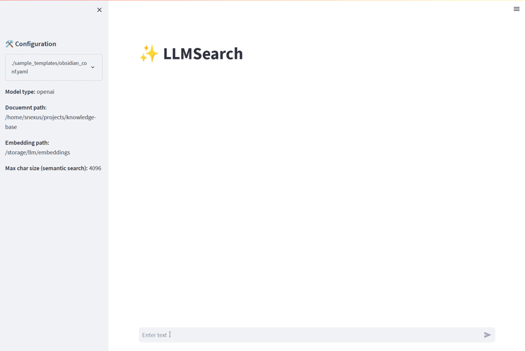

[](https://githubtocolab.com/snexus/llm-search/blob/main/notebooks/llmsearch_google_colab_demo.ipynb)

# LLM Search

The purpose of this package is to offer a convenient question-answering system with a simple YAML-based configuration that enables interaction with local documents. Special attention is given to improvements in various components of the system **in addition to** the LLM, including better document parsing, the ability to customize embeddings, advanced strategies for semantic search, and more. The package is designed to seamlessly collaborate with custom Large Language Models (LLMs) – whether from OpenAI or installed locally.

## Features

* Supported formats
    * `.md` - Divides files based on logical components such as headings, subheadings, and code blocks. Supports additional features such cleaning image links, adding custom metadata and more.
    * `.pdf`- MuPDF based parser.
    * `.html`, `.epub` - supported through `Unstructured` pre-processor - https://unstructured-io.github.io/unstructured/
    * `.docx` - custom parser, supports nested tables.
* Generates dense embeddings from a folder of documents and stores them in a vector database (ChromaDB).
  * The following embedding models are supported:
    * Huggingface embeddings
    * Sentence transformers based - e.g. `multilingual-e5-base`
    * Instructor - e.g. `instructor-large`
* Generates sparse embeddings using SPLADE (https://github.com/naver/splade), to allow a hybrid search (sparse + dense).
* Supports "Retrieve and Re-rank" strategy for semantic search, see - https://www.sbert.net/examples/applications/retrieve_rerank/README.html
* Allows interaction with embedded documents supporting the following models and methods (including locally hosted):
    * OpenAI (ChatGPT 3.5/4)
    * HuggingFace models
    * GGML models through LlamaCpp
    * AutoGPTQ Models (temporarily disabled due to broken dependencies)
* Other features
    * Simple CLI and web interfaces
    * An ability to save responses to offline database for future analysis.

## Demo



## Prerequisites

* Tested on Ubuntu 22.04.
* Nvidia GPU is required for embeddings generation and usage of locally hosted models.
* Python 3.10, including dev packages (`python3-dev` on Ubuntu)
* Nvidia CUDA Toolkit (tested with v11.7) - https://developer.nvidia.com/cuda-toolkit
* To interact with OpenAI models, create `.env` in the root directory of the repository, containing OpenAI API key. A template for the `.env` file is provided in `.env_template`
* For parsing `.epub` documents, Pandoc is required - https://pandoc.org/installing.html


## Virtualenv based installation

```bash
git clone https://github.com/snexus/llm-search.git
cd llm-search

# Create a new environment
python3 -m venv .venv 

# Activate new environment
source .venv/bin/activate

# Set variables for llama-cpp to compile with CUDA.
# Point to the location root of the install NVidia CUDA Toolkit (/usr/local/cuda on Ubuntu)
source ./setvars.sh /usr/local/cuda

# Install the package
pip install .

## Docker based installation

### Enable NVIDIA GPU on Docker

* https://linuxhint.com/use-nvidia-gpu-docker-containers-ubuntu-22-04-lts/
* Setup nvidia container toolkit - https://docs.nvidia.com/datacenter/cloud-native/container-toolkit/install-guide.html#setting-up-nvidia-container-toolkit

### Build the container

```bash
docker build -t deepml:latest ./docker
```

### Login interactively (bash) into container

* Run the following script with the argument specifying read-write folder for caching model. This folder will be mounted inside the container under `/storage`

```bash
./run_docker.sh RW_CACHE_FOLDER_NAME

# Install the package in development mode with CUDA BLAS support for LlamaCpp
cd /shared

# Set variables for llama-cpp to compile with CUDA.
# Point to the location root of the install NVidia CUDA Toolkit (/usr/local/cuda on Ubuntu)
source ./setvars.sh /usr/local/cuda

# Install the package
pip install .
```


# Quickstart

## Create a configuration file


To create a configuration file in YAML format, you can refer to the example template provided in `sample_templates/config_template.yaml`.

For the purpose of this explanation, let's assume that the documents are stored in the `/storage/llm/docs` directory. The following configuration file specifies how to load one of the supported locally hosted models, downloaded from Huggingface - https://huggingface.co/TheBloke/wizardLM-13B-1.0-GGML/resolve/main/WizardLM-13B-1.0.ggmlv3.q5_K_S.bin

As an alternative uncomment the llm section for OpenAI model.


[Sample configuration template](sample_templates/config_template.yaml)


## Creating Document Embeddings

To create embeddings from documents, follow these steps:

1. Open the command line interface.
2. Run the following command: `llmsearch index create -c config.yaml`

Based on the example configuration above, executing this command will scan a folder containing markdown and pdf files (`/path/to/docments`) excluding the files in `subfolder1` and `subfolder2` and generate a dense embeddings database in the `/path/to/embedding/folder` directory. Additionally, a local cache folder (`/path/to/cache/folder`) will be utilized to store embedding models, LLM models, and tokenizers.


The default vector database for dense is ChromaDB, and default embedding model is `e5-large-v2` (unless specified otherwise using `embedding_model` section such as above), which is known for its high performance. You can find more information about this and other embedding models at [https://huggingface.co/spaces/mteb/leaderboard](https://huggingface.co/spaces/mteb/leaderboard).

In addition to dense embeddings, sparse embedding will be generated in `/path/to/embedding/folder/splade` using SPLADE algorithm. Both dense and sparse embeddings will be used for context search.


## Interact with the documents using supported LLMs

To interact with the documents using one of the supported LLMs, follow these steps:

1. Open the command line interface.
2. Run one of the following commands: 

* Experimental web interface - `streamlit run ./src/llmsearch/webapp.py -- --config_path config.yaml`
* CLI interface - `llmsearch interact llm -c config.yaml`

Based on the example configuration provided in the `.yaml` file above, the following actions will take place:

- The system will load a quantized GGML model using the LlamaCpp framework. The model file is located at `/storage/llm/cache/WizardLM-13B-1.0-GGML/WizardLM-13B-1.0.ggmlv3.q5_K_S.bin`.
- The model will be partially loaded into the GPU (30 layers) and partially into the CPU (remaining layers). The `n_gpu_layers` parameter can be adjusted according to the hardware limitations.
- Additional LlamaCpp specific parameters specified in `model_kwargs` from the `llm->params` section will be passed to the model.
- The system will query the embeddings database using hybrid search algorithm using sparse and dense embeddings. It will provide the most relevant context from different documents, up to a maximum context size of 4096 characters (`max_char_size` in `semantic_search`).
- When displaying paths to relevant documents, the system will replace the part of the path `/storage/llm/docs/` with `obsidian://open?vault=knowledge-base&file=`. This replacement is based on the settings `substring_search` and `substring_replace` in `semantic_search->replace_output_path`.

## API

To launch an api, supply a path config file in the `FASTAPI_LLM_CONFIG` environment variable and launch `llmsearchapi` 

```bash
FASTAPI_LLM_CONFIG="./sample_templates/obsidian_conf.yaml" llmsearchapi
```
